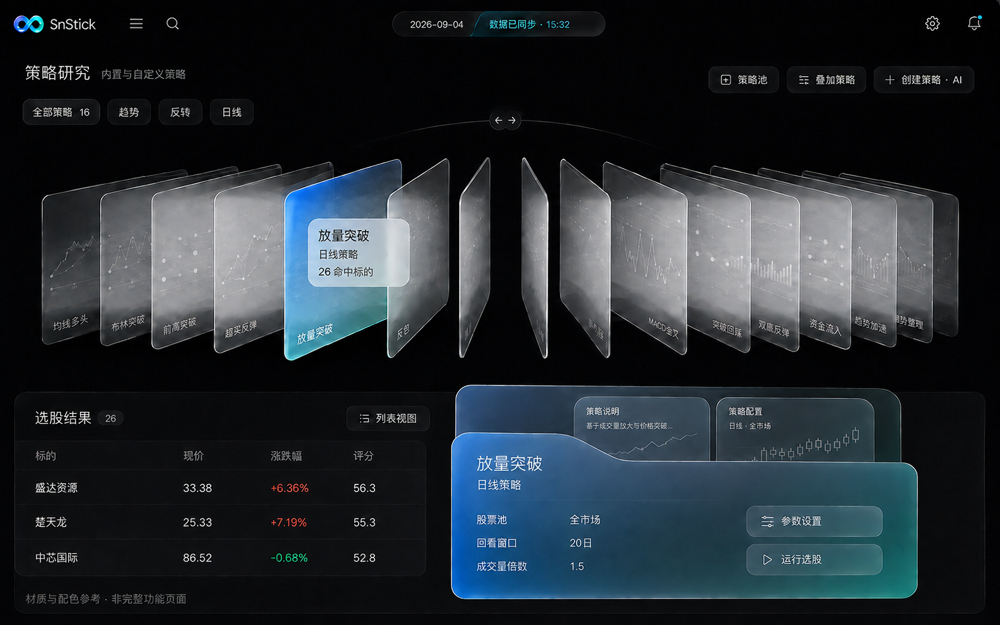
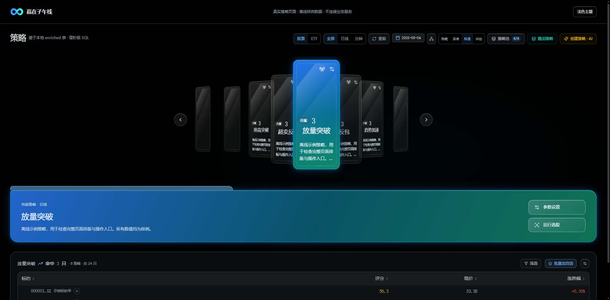
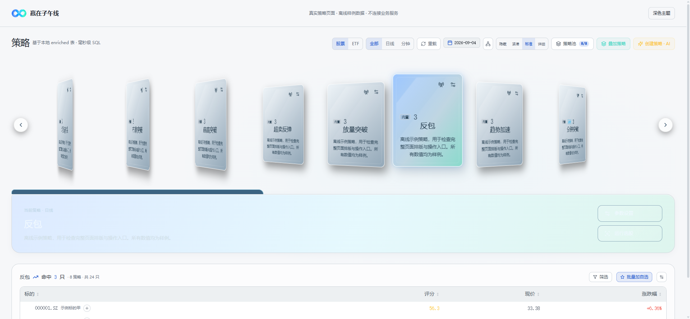

---
AIGC:
  ContentProducer: '001191110102MAD55U9H0F10002'
  ContentPropagator: '001191110102MAD55U9H0F10002'
  Label: '1'
  ProduceID: '4bce2405-f808-40ca-9fae-6ce303f6cfe1'
  PropagateID: '4bce2405-f808-40ca-9fae-6ce303f6cfe1'
  ReservedCode1: '63a21a65-1a9b-42fd-b8ef-6f3933e9c1dc'
  ReservedCode2: '63a21a65-1a9b-42fd-b8ef-6f3933e9c1dc'
---

# SnStick UI/UX 设计规范

> 版本：2.0 · 纯黑玻璃与扇形卡组  
> 适用：SnStick / 赢在子午线 A 股量化工作台  
> 方向：纯黑底、蓝青绿品牌渐变、选中发光、策略页扇形卡组、高可读数据区  
> 改造边界：保留业务功能、参数、数据与操作逻辑；允许调整视觉布局、比例与层次。

**版本状态：** v2.0 基于 2026-09-06 用户确认的 Codex 目标图（`docs/design/v2-target-codex.png`）对 v1.1 的四项克制决策进行翻转：纯黑底、选中整卡饱和渐变、选中态外发光、策略卡扇形排列。v1.1 的 token 架构、功能保留表与验收流程全部沿用。设计文档见 `docs/plans/2026-09-06-ui-v2-restyle-design.md`。

## 目录

1. 设计依据与原则
2. 品牌与 Logo
3. 色彩系统
4. 玻璃材质
5. 字体与数字
6. 布局与信息密度
7. 圆角、边框与阴影
8. 图标与交互状态
9. 组件规范
10. 页面应用与功能保留
11. 图表与金融语义
12. 响应式、无障碍与动效
13. 代码与设计变量
14. 验收及维护
15. 策略页视觉校正与验收（v1.1，卡片视觉已被 §16 取代）
16. 扇形卡组（v2.0）

## 1. 设计依据与原则

本规范以用户确认的中等浓度方案为视觉基准。参考图中的蓝色应清晰接近 Logo 左侧的宝蓝，过渡到亮青与少量薄荷绿；颜色通过玻璃折射、局部染色和细边缘表现，避免铺满饱和渐变，也避免弱到只剩灰色。



**此图不是完整功能页面，也不是金融数据依据。** 策略页吸收透视卡片和文件夹层次；不采用会遮挡控制的极端扇形折叠，不把图中示意曲线作为真实行情。不能据此删除列表字段、收起原有入口或增加新的分析指标。

参考的 ClauseOS 文档提供材质分层、字号体系、焦点、减弱动效等思路。合同流程、霓虹绿色、固定栏宽和三维布局不直接迁移。

设计原则：

- 数据优先：价格、指标、参数、更新时间与状态始终清晰。
- 功能等价：视觉前后使用同一业务组件、同一数据接口和同一状态逻辑。
- 轻材质：通过边缘、反射与底色形成玻璃感，而不是堆叠模糊滤镜。
- 品牌克制：中性底色占主体，蓝青主要用于选择、操作和品牌。
- 稳定扫描：实时更新不引起位置、字号、行高或容器变形。
- 深浅一致：两种主题共用结构，但独立设置颜色和透明度。

## 2. 品牌与 Logo

### 2.1 正式资产

原始图片位于 `frontend/public/brand/tianji-original.png`，从用户提供文件原样复制，保留透明通道、蓝青渐变与立体高光。

`frontend/src/components/Logo.tsx` 使用 SVG 视口 `24 132 526 300` 展示原图中的无限环；内部 image 尺寸仍为原始 1550 × 546。这样无需重绘、调色或修改原始像素。

- 不把 AI 概念图中的生成标志用作正式 Logo。
- 不拉伸、旋转、套色或施加颜色滤镜。
- 不在 Logo 外再加彩色发光。
- 保留生产项目的中文名称“赢在子午线”；本次不做产品重命名。
- 常规导航使用 40px 方形占位，收起态 32px；图形按原比例居中。
- Logo 的可访问名称为“天玑实验室”。

### 2.2 品牌渐变

| 位置 | 参考色 | 用途 |
| --- | --- | --- |
| 起点 | `#287BFF` | Logo 左侧宝蓝、选中材质左侧折射 |
| 中段 | `#00BFEF` | 亮青过渡、细小高光 |
| 终点 | `#10B981` | 少量薄荷绿折射 |

v2.0 端点色对齐用户 Codex 目标图；Logo 本身仍直接使用原图，不套色。

## 3. 色彩系统

### 3.1 核心深浅主题

现有 HSL CSS 变量名保持不变，使全项目已有 Tailwind 类继续生效。

| Token | 暗色 HSL | 亮色 HSL | 用途 |
| --- | --- | --- | --- |
| `--base` | `0 0% 0%` | `210 20% 97%` | 页面底色（暗色为纯黑） |
| `--surface` | `220 14% 7%` | `0 0% 100%` | 内容实体底色 |
| `--elevated` | `220 12% 11%` | `210 18% 94%` | 菜单、表头、局部层次 |
| `--border` | `213 9% 25%` | `213 14% 84%` | 分隔与轮廓 |
| `--fg-primary` | `210 17% 94%` | `216 20% 14%` | 标题、正文与主数据 |
| `--fg-secondary` | `212 12% 77%` | `215 14% 34%` | 次级信息 |
| `--fg-muted` | `213 10% 63%` | `215 10% 44%` | 帮助、说明、元信息 |
| `--accent` | `211 100% 73%` | `221 83% 44%` | 链接、焦点附近的强调文字 |

`--accent` 是界面交互强调，不等同 Logo 原始宝蓝。深色文字适当提亮，亮色文字适当加深。主按钮使用独立深蓝背景以维持白字对比度。

### 3.2 金融与状态语义

| Token | HSL（保持原值） | 原有用途 |
| --- | --- | --- |
| `--bull` | `4 87% 60%` | A 股上涨 |
| `--bear` | `152 67% 45%` | A 股下跌 |
| `--warning` | `32 95% 50%` | 注意、等待等已有状态 |
| `--danger` | `4 87% 60%` | 错误或危险操作 |

本次不重新解释历史组件的颜色，不修改涨跌、阈值、评分、图表序列或单位。品牌薄荷色不得覆盖价格与 K 线颜色。成功与失败仍同时显示图标或文字。

### 3.3 浓度控制

- 普通内容：纯黑底上叠白色半透（约 5–9%）玻璃卡，细白描边（约 14%）。亮色保持实体中性底。
- 选中策略 / 导航 / 详情参数卡：整卡可感知的品牌渐变——暗色蓝端 55%、中段 28%、绿端 38%（160deg 竖卡 / 115deg 横卡）；亮色维持 v1.1 克制浓度。
- 发光：仅选中态启用（见 §4 发光层）。
- 真正 Logo：保留原有饱和度。

## 4. 玻璃材质

| 层级 | 用途 | 实现 | 边界 |
| --- | --- | --- | --- |
| 实体内容 | 表格、图表、数据面板 | 不透明 surface，必要时轻反射 | 不使用背景模糊 |
| 普通磨砂 | 策略卡、普通卡片 | 暗色为纯黑底叠白色半透（约 5%）+ 轻反射；亮色为 surface + `--glass-sheen` | 不改变原有卡片尺寸 |
| 选中染色 | 已选策略、当前导航 | 普通磨砂 + `--glass-selected`（整卡可感知渐变） | 不遮挡文字；发光见 §7.2 |
| 浮层 | 导航、弹窗 | 边缘高光 + 轻阴影 | 弹窗内容实体；导航以平面反射模拟玻璃 |

暗色普通反射从白色 7.5% 渐隐到 1.2%，然后透明。亮色反射从白色 72% 渐隐到 12%。

导航底色不透明度为暗色 95%、亮色 94%，以渐变反射模拟磨砂玻璃，不使用 `backdrop-filter`：该属性会建立包含块，使导航内原有 fixed 能力浮层受到 overflow 裁切。用户要求降低透明度时使用实体底色。不得对每个表格单元格、每张实时小图或滚动行施加 blur。

## 5. 字体与数字

### 5.1 字体栈

- UI：Inter → HarmonyOS Sans SC → PingFang SC → Microsoft YaHei UI → Microsoft YaHei → system-ui。
- 数字：JetBrains Mono → IBM Plex Mono → ui-monospace。
- 不新增字体服务；沿用现有字体加载，断网时使用系统回退。
- 不用手写体和文字发光呈现产品名称。

### 5.2 排印层级

| 场景 | 使用建议 | 本次处理 |
| --- | --- | --- |
| 页面标题 | 18–24px，600 | 保留现有字号，以共享标题组件统一字距 |
| 区块标题 | 14–16px，500–600 | 保留原页面层级 |
| 常规表格 | 13–14px，400–500 | 共享股票表格保留 14px |
| 紧凑控制 / 元信息 | 11–12px | 保留密度选项，不全局放大 |
| 既有极小标签 | 8–10px | 本次未逐个改动，作为后续可读性专项检查项 |
| 关键数字 | 20–28px | 依据原卡片，不新增指标卡 |

数值启用 `tabular-nums`，保留小数位与格式化函数；文本左对齐、金额等按现有列定义对齐。禁止为了视觉统一而改变单位换算、百分比符号或时间口径。

## 6. 布局与信息密度

本次保留原有布局：

- 导航展开宽度 14rem；图标栏 3.5rem；隐藏态为 0。
- 原来的展开 / 图标栏 / 隐藏 / 悬停预览以及移动抽屉继续工作。
- 页内筛选器、工具栏、分栏、表格和弹窗位置不重排。
- 保留自选和策略的卡片 / 表格显示方式，以及策略卡 mini、normal、large、hidden 模式。
- 保留可配置列、排序、横向滚动和虚拟列表行高。
- 间距仍使用项目已有 Tailwind 4px 基准；不为了留白挤掉内容。

策略页允许调整卡片比例与浏览排布，保留紧凑和隐藏模式。标准、详细模式按 §15 执行。

## 7. 圆角、边框与阴影

### 7.1 圆角

| Token | 数值 | Tailwind 类 |
| --- | --- | --- |
| `--radius-card` | 12px | `rounded-card` |
| `--radius-control` | 8px | `rounded-btn` |
| `--radius-input` | 6px | `rounded-input` |
| `--radius-dialog` | 18px | `rounded-dialog` |

本次统一已有命名圆角。`rounded-full`、原生图表及明确固定尺寸的圆角不批量替换。

### 7.2 边缘、阴影与发光（v2.0）

- 暗色顶部内高光：白色 17%；亮色顶部内高光：白色 88%。
- 暗色普通面板：`inset 0 1px 0 var(--glass-line), 0 4px 18px rgb(0 0 0 / .10)`。
- 暗色浮层：`inset 0 1px 0 var(--glass-line), 0 18px 52px rgb(0 0 0 / .34)`。
- 亮色普通面板：4px / 16px、冷灰 4% 的轻阴影。
- 发光层（v2.0 新增，替代 v1.1 的"不使用外发光"）：

| 元素 | 表现 | 降级 |
| --- | --- | --- |
| 选中策略卡 / 扇形居中卡 | `--glow-brand`（暗色 30% 蓝 + 25% 青双辉光）+ 青色描边 | `prefers-reduced-transparency` 时去除 |
| 导航当前项 | 同上 | 同上 |
| 详情参数卡（当前策略面板） | 同上 | 同上 |
| 数据表格、正文、普通按钮 | 不发光 | — |

- 发光只作为选中态的边界强调，不扩散到未选中元素或大面积背景；不给每层嵌套卡片重复叠加阴影。

## 8. 图标与交互状态

沿用已安装的 Lucide，保留图标含义，不引入新图标库。导航约 16px，按钮图标依据原控件使用 12–18px。

| 状态 | 表现 |
| --- | --- |
| 默认 | 中性背景、银灰边缘 |
| 悬停 | 边框或背景轻微变化，不位移 |
| 已选 | 中等浓度蓝青染色 + 原有选择标记 |
| 键盘焦点 | 清晰 2px 外环，3px 偏移 |
| 禁用 | 保留既有 disabled、光标与透明度，不用颜色伪装可点击 |
| 加载 | 原有进度 / 骨架 / 加载图标；保留已有有效数据 |
| 无数据 / 错误 / 无权限 | 保留实际状态与说明，不用示例内容填充 |

## 9. 组件规范

### 9.1 导航

使用 `.sn-navigation`，保留全部导航项、菜单偏好、自选分组与扩展入口。当前页用有细反射的蓝青材质，原竖向选择标记改为品牌渐变，不增加辉光。品牌区取消旧紫色文字发光。

### 9.2 页面标题

使用 `.sn-page-header`，内容、工具栏、换行规则和高度保持现有组件约束；只添加轻反射、底部分隔和统一标题字距。

### 9.3 策略卡

使用 `.sn-strategy-card` 与 `.sn-strategy-card--active`。保留运行、设置、监控、来源标签、周期徽章、数量、失效数量及所有密度模式。普通命中数量改为主文字色，避免与风险或收益含义混淆。

来源标签保留原有色相；亮色主题的琥珀、紫、青绿文字分别加深为 `#8A5300`、`#7540AA`、`#0B756C`，避免浅色小字融入白底。

### 9.4 按钮与表单

已有主要操作使用深蓝至深青渐变，白字；品牌绿色不大面积进入按钮。次按钮仅有轻反射与内高光。输入框保留校验、原生选择、焦点和禁用行为。所有样式选择器不修改 pointer-events 或事件处理。

### 9.5 表格

`.sn-stock-table` 使用实体底色和等宽数字；表头层次清楚。保留列定义、排序指示、行内图表、选中、批量操作、固定表头、横向滚动及虚拟化，不改行高。

### 9.6 数据面板

现有 `rounded-card` + surface 类面板应用轻反射。财务、回测和行情图表不使用渐变数据背景；避免光感干扰曲线识别。

### 9.7 弹窗

共享 Modal 面板使用 `.sn-dialog`，内部实体底色，轻高光与浮层阴影。保留现有尺寸、关闭行为、Esc、焦点陷阱与返回焦点。未使用共享 Modal 的专用弹窗继续使用已有组件，受到主题变量影响，不假定统一了全部弹窗结构。

## 10. 页面应用与功能保留

| 原模块 | 样式应用 | 必须保留 |
| --- | --- | --- |
| 看板 | 全局色板、面板、文字 | 市场指标、事件、榜单、日期及刷新 |
| 自选 | 导航、表格、控件 | 分组、视图、字段、导入、排序、图表 |
| 策略 | 标题、卡片、表格 | 股票/ETF、策略池、AI、叠加、参数、监控、列设置 |
| 回测 | 标题、参数区、图表色板 | 因子/策略/验证、候选、任务、交易明细和导出 |
| 挖掘 | 主题和控件 | 候选、任务、发布门槛、显式发布 |
| 个股/财务 | 表格、图表、弹窗 | 标的选择、关键价位、财务报表、报告 |
| 市场分析 | 面板和主题 | 概念、行业、连板、环境、指数与穿透 |
| 监控/异动 | 规则列表和控件 | 条件、作用域、启停、记录、通知、异动分类 |
| 复盘 | 阅读层次和面板 | 日期、报告生成、历史、下载、推送 |
| 持仓 | 表格和编辑框 | 数量、成本、日期、目标、止损与提醒 |
| 数据/设置 | 卡片、导航、表单 | 数据源、路由能力、任务、配置、扩展和菜单 |
| 登录/向导 | Logo、主题与控件 | 认证与首次使用流程 |

此表说明代码保留约束，不等同这些业务已全部完成端到端测试。功能验证结果另见验收记录。

## 11. 图表与金融语义

Canvas 不直接继承全部 CSS，统一图表文字、边框和 tooltip 从 `frontend/src/lib/theme.ts` 调整：

- 深色普通文字 `#A0A9B4`，强调文字 `#EDF0F3`。
- 深色 tooltip `rgba(23,26,29,0.98)`，接近实体背景。
- 亮色普通文字 `#657180`，强调文字 `#1D232B`。
- 保留涨跌红绿、各技术指标序列配色与所有数据。
- 坐标、交易日、复权、费用、成交、收益、净值和因子口径不改动。
- 不把示意曲线、命中理由、胜率或 AI 建议加入正式页面。

## 12. 响应式、无障碍与动效

### 12.1 响应式

沿用原 `useIsDesktop`、抽屉和页面断点。检查 1440px 桌面、1024px 笔记本、390px 窄屏；表格可以在自身容器横向滚动，但不能挤出导航或遮挡操作。增加圆角不能剪掉按钮或下拉菜单。

### 12.2 可访问性

- 主要和辅助文字的对比度在实际背景上检查；不能只凭色值名称认定合格。
- 键盘焦点：暗色 `#83C1FF`，亮色 `#245DDD`。
- 高对比模式为选中项保留系统 Highlight 轮廓。
- 不仅用颜色表达状态；保留原文案、符号与图标。
- 本轮不是全仓无障碍整改：极小标签、历史半透明文字和各业务专用控件仍需专项检查。

### 12.3 动效与性能

原过渡时间和流程不改动；不增加持续旋转、卡片上浮或实时数据位移。CSS 响应 `prefers-reduced-motion`，Framer Motion 通过 `MotionConfig reducedMotion="user"` 跟随系统减少位移动效。

导航支持 `prefers-reduced-transparency` 降级。不在实时列表添加背景滤镜，不改变虚拟列表估算行高，不创建额外数据查询。

## 13. 代码与设计变量

### 13.1 文件职责

| 文件 | 职责 |
| --- | --- |
| `frontend/src/index.css` | 深浅主题、品牌 RGB、材质、圆角、焦点、滚动条 |
| `frontend/src/styles/workstation.css` | 组件材质和选择状态，不承载业务逻辑 |
| `frontend/tailwind.config.ts` | 字体回退、圆角 token 映射 |
| `frontend/src/components/Logo.tsx` | 真实品牌资产的比例和视口 |
| `frontend/src/lib/theme.ts` | 画布图表的文字与中性背景色 |
| `frontend/src/main.tsx` | 样式入口及减弱动效配置 |
| `frontend/qa/` | 使用真实共享组件的独立离线样例，不导入生产 API，不进入正式路由 |

### 13.2 核心实现片段

```css
:root {
  --brand-blue: 18 96 255;
  --brand-cyan: 0 191 239;
  --brand-mint: 18 221 186;
  --radius-card: 12px;
  --radius-control: 8px;
  --radius-input: 6px;
  --radius-dialog: 18px;
}
html.dark {
  --glass-selected: linear-gradient(115deg,
    rgb(var(--brand-blue) / .34),
    rgb(var(--brand-cyan) / .08) 52%,
    rgb(var(--brand-mint) / .20));
}
.sn-strategy-card--active {
  background-color: hsl(var(--surface));
  background-image: var(--glass-selected), var(--glass-sheen);
}
```

实现源码为最终值的权威；改变源码中的 token 时同步更新本表。页面不建立第二套主题状态，继续使用原来的 `tf-theme` 与主题事件。

## 14. 验收及维护

### 14.1 必须核对

- 原菜单、路由、表格列、参数、策略来源和显示模式没有被删除。
- 后端、API、查询键、状态存储、事件处理与用户配置未改变。
- 原始 Logo 文件一致，深浅背景下比例正确。
- 实际界面有清晰的宝蓝—青—薄荷过渡，同时文字区保持克制。
- 深浅主题、窄屏、加载、空数据、错误和弹窗状态能够辨认。
- TypeScript 与 Vite 构建通过，git diff --check 无空白错误。
- 实际运行前后端业务、远端权限与数据覆盖等未验证事项如实记录。

### 14.2 变更与回退

本次无数据迁移、配置升级或新依赖。样式可按文件差异回退，原始 PNG 单独保存。不要回退用户原有的 vite.config.ts 修改。不要通过全仓重置回退本次 UI。

后续新页面继续使用现有共享组件和 token；增加卡片、菜单、参数或交互模式属于功能/交互任务，需要单独界定，不得以“样式优化”为由夹带。

### 14.3 本次验收记录（2026-09-05）

| 检查 | 结果与范围 |
| --- | --- |
| 生产 TypeScript | `tsc -b` 通过 |
| 离线样例 TypeScript | `tsc -p qa/tsconfig.json --noEmit` 通过 |
| 生产构建 | `vite build` 通过，2735 个模块；ECharts 分块约 1035 kB 的体积告警仍存在 |
| 差异检查 | `git diff --check` 通过；保留用户已有 Vite 代理配置 |
| Logo 一致性 | SHA-256 与用户原图一致：`B48A04DBC4AA04DB17AE34789552C4C3F052081A76CEEC680BC92292B6763275` |
| 离线视觉 | 桌面深浅主题、真实共享策略卡和表格、390px 样例容器、加载/禁用/空数据状态已检查 |
| 弹窗交互 | 实际 Modal 组件自动聚焦输入框，Tab 循环留在弹窗，Esc 关闭并返回触发按钮 |
| 代码复核 | 未发现本次更改菜单、路由、查询或业务计算；已修复导航浮层裁切风险和主按钮对比度问题 |
| 完整业务联调 | 未验证。自动审批拒绝刷新带外部 API 代理的正式页面，原因是可能发送会话信息；没有重试该网络访问 |

离线验收入口及启动说明见 `frontend/qa/README.md`。它使用真实共享组件和明确标注的样例数据，不加载正式应用入口。390px 是组件容器检查，不代表已验证真实移动 viewport、导航抽屉或全部业务页面；1440px/1024px 实际业务断点、虚拟化大列表、行情图表及真实权限/错误状态仍需联调环境验收。

主要文字在实体 surface 上的计算对比度：暗色主/次/辅助约 15.31 / 9.96 / 6.61，亮色约 15.94 / 7.60 / 5.14；主按钮白字在渐变端点上的比值约 6.00–6.84。此记录仅针对列出的颜色组合，不作为所有半透明标签和业务控件均符合无障碍标准的声明。

## 15. 策略页视觉校正与验收

### 15.1 目标与范围

本轮为 L3 局部页面样式修改：直接复用 `Screener` 和 `StrategyCard`，新增 `strategy-studio.css`。没有适合整体卡片排布的现成插槽；不建立第二套业务页面、策略执行或请求缓存。

保留全部资产/周期筛选、日期、重载、全部结果、卡片密度、策略池、叠加和 AI 创建入口，以及原来的表格、参数弹窗、监控回调。新增当前策略展示区只重复已有参数设置和运行入口，使用原回调。导航仍沿用生产 Layout，本地样板顶部品牌栏仅用于预览。

### 15.2 实际视觉参数

> v2.0 注：本节的卡片配色/旋转参数已被 §16 扇形卡组取代（纯黑玻璃底 + coverflow 层级）；页面标题、尺寸、密度兼容等约束继续有效。

- 页面标题 26px / 500，顶部 30px，内容左右 32px；窄屏左右 16px。
- 标准卡片 184 × 244px，详细卡片 224 × 284px；同一横向滚动区域展示全部策略，保留原排序。紧凑模式仍自动换行，隐藏模式仍隐藏卡片。
- 普通卡片银灰反射使用 `#A4AFB5 → #69767E → #3A464E → #1B252D`，内外双层细边缘。
- 普通卡片旋转 Y 轴 −22°，选中 −6° 并抬升 10px；悬停/焦点归正，减少动效设置时取消透视角度和位移。没有自动轮播或持续运动。
- 选中卡片以 `#217CF0` 局部折射叠加 `#528AB8 → #344E60 → #277C7B`。原始 logo 不调色。
- 当前策略以文件夹页签轮廓呈现，使用真实名称、说明、周期，不虚构参数值。实体结果表独立置于下方，避免叠层遮挡行情。
- CSS 独立 `rotate` / `translate` 属性避免覆盖 Framer Motion 已有的进入动画。卡片内不增加示意行情线。

### 15.3 页面验证与预览

`frontend/qa/strategy-page.tsx` 直接挂载生产 `Screener`，独立 Vite 配置在 3013 端口提供标注为示例的本地响应。没有 API 代理，未支持的操作返回明确的离线错误，不向远端转发，也不写入生产配置。

已通过：生产 TypeScript、离线页 TypeScript、Vite 构建（2736 模块）、真实页面卡片选择与结果加载、参数弹窗打开和关闭、深浅主题、390px 整页溢出检查、紧凑/隐藏/标准切换、日线/分钟筛选。页面检查未出现未捕获 JS 错误。

尚未完成：用户视觉验收、向其他业务页推广、真实后端操作及行情联调、全应用导航与策略页组合后的端到端检查。独立样板没有替代这些验收。


窄屏截图：`docs/design/strategy-page-mobile.png`。以上截图均为真实页面组件配合离线样例，不能用作行情依据。

## 16. 扇形卡组（v2.0）

### 16.1 排布与层级

- 标准/详细密度下，策略卡按 coverflow 扇形排布：居中卡（`data-fan='center'`）正面全尺寸 + 整卡 168° 品牌渐变 + 发光；两侧按 `near`（±26°，scale .95，透明度 .92）→ `mid`（±38°，scale .88，透明度 .78）→ `far`（±46°，基础样式）递减后退。
- 全部策略仍可达：扇形为可视窗口展示，横向滚动保留原排序；选中变化时居中卡平滑滚动到视口中央。
- 紧凑模式自动换行、无扇形无箭头；隐藏模式不变。

### 16.2 交互

- 左右箭头切换居中策略（边界禁用）；点击侧卡居中并选中；悬停/键盘焦点归正预览；卡组容器支持 ←/→ 方向键（`role=group` + aria 标签）。
- 交互仅复用既有 `activeStrategy` 状态，不触发选股运行，不新增数据请求；参数设置、运行选股、监控回调沿用 §15.1 约定。

### 16.3 降级

- `prefers-reduced-motion`：取消 rotate/translate/scale 与过渡；窄屏（≤720px）：隐藏箭头；扇形容器溢出限制在自身横向滚动内，不得挤出导航。





> AI生成